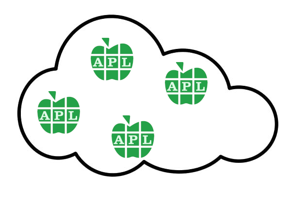

Claude Cloud
============

Deploy an APL64-powered Azure Durable Function with help from Claude Code.

## Background

Superval is an APL+Win desktop application recently migrated to APL64
from [APL2000](http://www.apl2000.com/). It allows actuaries to
evaluate the liabilities of a defined-benefit pension scheme under
different scenarios.

It consists of an extensive GUI based on APL's `⎕WI` primitive, which
is used to prepare data files for calculation, which produces
reports. The data for a calculation consists of facts about the
scheme and its members and parameters that describe the scenario.

The calculation process entails evaluating each member record. Schemes
with many members can take hours to evaluate. The evaluations are
independent, so the whole calculation is a prime candidate for
parallel processing.

The data files for a large calculation are <500MB.

## Goal

The project goal is to cut calculation time significantly by deploying
the calculation as an Azure Durable Function, exploiting its capacity
for horizontal scaling on the fan-out/fan-in model, and creating
processing resources on the Azure cloud platform for the duration of
the calculation.

The project expects on-demand horizontal scaling to avoid 

-   configuring and paying for permanent cloud computing resource
	that is likely to be idle for long periods
-   developing orchestration software to manage the fan-out and fan-in 

At some future time we might migrate the application to Dyalog APL.
The calculation would be easier to migrate than the GUI, so it would
be advantageous then if the calculation were already running
separately on a cloud platform. A secondary goal of the project is to
confirm that a Dyalog APL process can be deployed as an Azure
Function or an Azure Durable Function.

## Technical risks

1.  We are unfamiliar with the Azure cloud; the project will be a learning experience.
2.  APL is not one of the programming languages Azure supports; we cannot upload
	APL source code to be run, but must provide a binary executable, which depends on
	the .Net framework.
3.  We know of no examples of deploying APL processes to a cloud platform.
4.  We have little familiarity with Docker, especially on a Windows platform.
5.  We have little familiarity with APL64's new cross-platform component.

### APL64

> An APL64 cross-platform component (CPC) is a Nuget package containing
> a .Net Core assembly which exposes one or more APL64
> programmer-defined ‘public’ functions in the workspace. This package
> may be used as part of a containing .Net application to support the
> APL business rules or algorithms of the application. Any .Net
> programming language may be used to access the APL64 cross-platform
> component in a hardware and operating system environment which
> supports Microsoft .Net Standard v2.1.

Preliminary trials have produced CPCs of about 300MB.

### Dyalog APL

Dyalog APL can export a binary runtime. Including a .Net framework means it weighs about 300MB.

## Project parts and phases

To manage the technical risks we can proceed in small steps.

The scripting language is C#. APL64 cross-platform components (CPCs)
are .NET assemblies consumed as NuGet packages, so C# gives native
integration. The Azure Functions runtime includes .NET, which also
allows APL64 to export thin CPCs that omit the .NET runtime.

Dyalog APL integration is deferred to a final phase (Part 3).

### Part 1: Azure Function (AF)

Part 1 must be completed before starting Part 2.

The goal of this part is to confirm that we can deploy an APL64 CPC
process as an Azure Function.

For proof of concept we use as POST payload a CSV file representing
a matrix of numbers, for which column sums are to be calculated.
The AF result is a JSON list of column sums.

The AF runtime provides a 500 MB local file system at `D:/home`.
The CSV payload is written there for the CPC to read, since the
AddNumbers CPC takes a file path as its parameter.

1.  Create a simple Azure Function in C# (square/cube roots). **Done.**
2.  Replace with an APL64 CPC (`AddNumbersinFile`) that reads a CSV
    file and returns column sums as a JSON list.

Tests will confirm the JSON list in the result is the correct column sums.

### Part 2: Azure Durable Function (ADF)

An AF is designed for a fast response and its limits on execution time
preclude its use for a Superval calculation.
For this we need an ADF, which is allowed longer to complete its work.

Our ADF workflow must begin with the upload of a large file to be worked on
by multiple Worker processes.

For proof of concept we can use the same CSV file as for the AF.

1.  Create an Azure Durable Function in C#.
2.  Replace with an APL64 CPC executable.

Tests will confirm the JSON list in the result is the correct column sums.

### Part 3: Dyalog APL integration

Replace the APL64 CPC with a Dyalog APL executable in both the AF
and ADF, confirming that Dyalog APL processes can also be deployed
to Azure Functions.

## Questions

**The project is achievable only if (1) or (2) is Yes.**

### Open

1.  A Superval calculation takes as input a ZIP of <500MB. The Orchestration
	process must start Worker processes with read access to the ZIP contents.
	How should this be done? Azure File or Azure Blob?
2.	Does invoking the ADF require two steps: (a) upload the input file,
	(b) start the ADF? Or can the upload invoke the ADF?
3.  When the ADF completes can the Orchestrator process delete the input file,
	or must this be initiated outside the Azure cloud?

### Answered or decided

1.  Does the Azure .NET runtime restrict the choice of scripting language?
	**C# selected.** APL64 CPCs are .NET assemblies consumed as NuGet
	packages; C# gives native integration. The Azure Functions .NET runtime
	supports C# directly.

2.  Can either APL64 or Dyalog APL export an executable that depends on
	.Net in its execution environment?
	**No** (as of 2025). Dyalog is considering this for a future release.

3.  Can either an AF or an ADF accept a 300MB executable, either uploaded
	as part of the function definition, or imported from a NuGet repository?
	**Yes** (applies to both AF and ADF; Durable Functions is an extension
	running on the same hosting infrastructure). Max deployment package is
	1 GB. Temp storage limits by plan:

	| Plan                | Temp Storage | Scales to Zero | 300MB viable? |
	|---------------------|--------------|----------------|---------------|
	| Consumption         | 500 MB       | Yes            | Tight         |
	| Flex Consumption    | 800 MB       | Yes            | Yes           |
	| Consumption (Linux) | 1.5 GB       | Yes            | Yes           |
	| Premium             | 21-140 GB    | No             | Yes           |
	| Dedicated           | 11-140 GB    | No             | Yes           |

	**Recommendation**: Use Flex Consumption plan. It has sufficient temp
	storage (800 MB) for a 300 MB package, scales to zero when idle, and
	uses pay-per-execution billing. Premium and Dedicated plans incur costs
	even when idle. Deploy via custom handler.

	Sources (retrieved 2026-02-01):
	- https://learn.microsoft.com/en-us/azure/azure-functions/run-functions-from-deployment-package
	- https://learn.microsoft.com/en-us/azure/azure-functions/functions-custom-handlers
	- https://learn.microsoft.com/en-us/azure/azure-functions/functions-scale
	- https://learn.microsoft.com/en-us/azure/azure-functions/flex-consumption-plan
	- https://azure.microsoft.com/en-us/pricing/details/functions/

